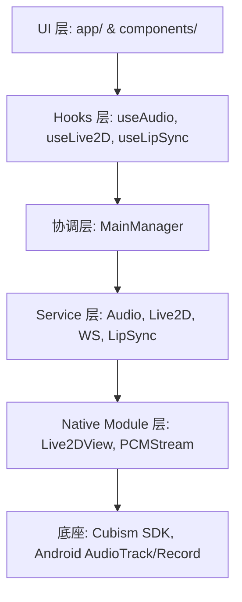

# 架构设计 (Architecture Design)

## 2.1 整体分层方案

## 2.2 核心设计模式

### Service 模式
核心逻辑封装为 TypeScript Class (如 `AudioService`, `Live2DService`)。
- **解耦**：不依赖 React 组件生命周期。
- **可测试性**：支持在非 UI 环境下进行逻辑验证。
- **持久性**：状态在页面切换时可保持。

### Manager 单例模式
`MainManager` 作为全局协调中心。
- **职责**：处理跨服务的复杂业务逻辑（如收到 AI 文本时调用 Live2D 播放动作）。
- **注册制**：各 Service 实例初始化后向 Manager 注册。

### Hook 桥接模式
通过 Hooks (如 `useAudio`) 将 Service 的事件驱动状态流转为 React 的响应式 `State` 或 `Ref`。
- **UI 绑定**：方便组件直接消费实时音频统计或连接状态。
